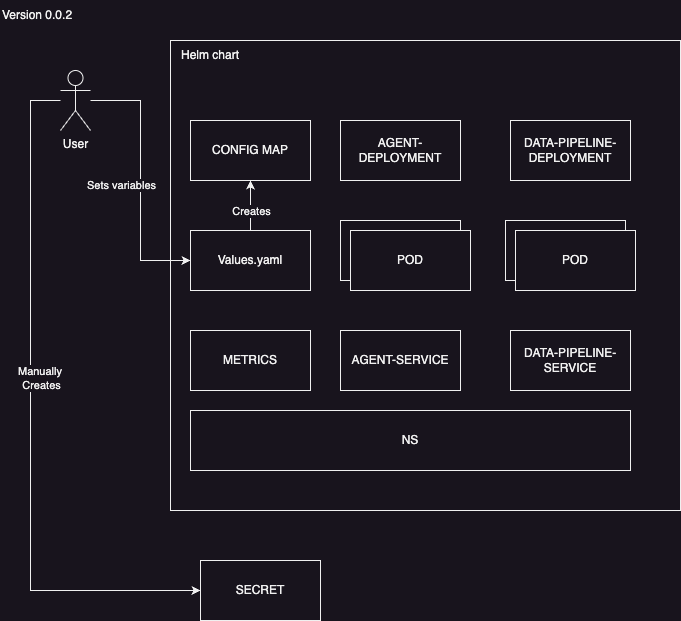

# KubeRAG


### A simple helm chart automating deployment of a retrieval augmented generation (RAG) solution on K8s Clusters.


# Architecture 


# Getting started

## Prerequisites

*   Python 3.10+
*   Docker
*   Docker Compose
*   Helm

## Environment Setup

1.  **Create a virtual environment:**

    ```shell
    python3 -m venv venv
    source venv/bin/activate
    ```

2.  **Install dependencies:**

    ```shell
    pip install -r Orchestrator/Agent/requirements.txt
    pip install -r Orchestrator/Data-Pipeline/requirements.txt
    ```

3.  **Set up environment variables:**

    Create a `.env` file in the root of the project and add the following environment variables:

    ```
    LLM_FRAMEWORK=<your-llm-framework>
    VECTOR_STORE=<your-vector-store>
    API_KEY=<your-api-key>
    ```

    Replace `<your-llm-framework>`, `<your-vector-store>`, and `<your-api-key>` with your desired values.

## Running the Project

### Running the Data Pipeline

To run the data pipeline, navigate to the `Orchestrator/Data-Pipeline` directory and run the following command:

```shell
uvicorn app:app --host 0.0.0.0 --port 5001
```

### Running the Agent

To run the agent, navigate to the `Orchestrator/Agent` directory and run the following command:

```shell
uvicorn app:app --host 0.0.0.0 --port 5000
```

### Running with Docker Compose

To run the application using Docker Compose, run the following command from the root of the project:

```shell
docker-compose up --build
```

## Deploying to Kubernetes

You can deploy the application to a Kubernetes cluster using the provided Helm chart.

1.  **Build the Docker images:**

    ```shell
    docker buildx build . -f Orchestrator/Agent/Dockerfile -t <your-docker-repo>/kuberag-agent:latest --platform=linux/amd64,linux/arm64 --push
    docker buildx build . -f Orchestrator/Data-Pipeline/Dockerfile -t <your-docker-repo>/kuberag-data-pipeline:latest --platform=linux/amd64,linux/arm64 --push
    ```

    Replace `<your-docker-repo>` with your Docker repository.

2.  **Install the Helm chart:**

    ```shell
    helm install my-release KubeRag -f myvalues.yaml
    ```
